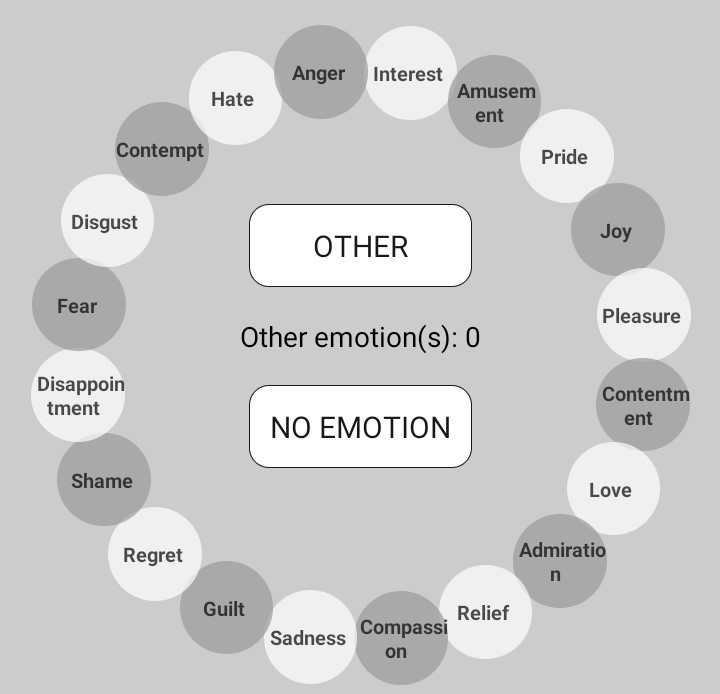
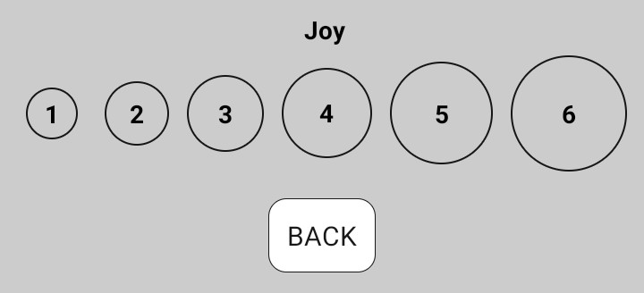
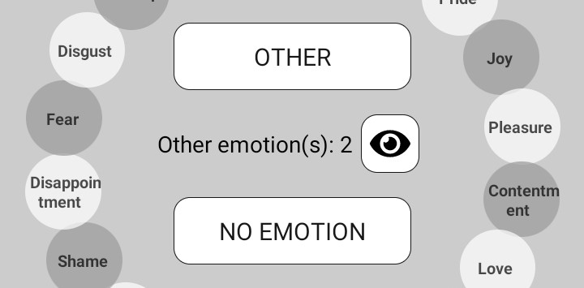
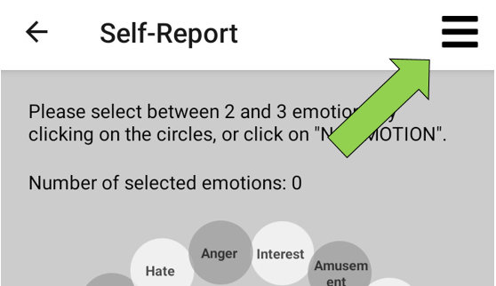
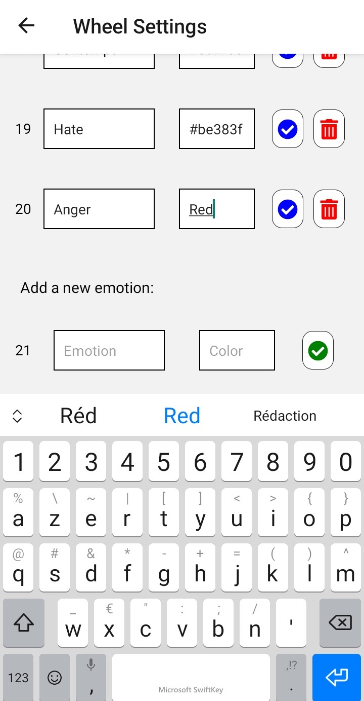

<!--
/*
 * Copyright 2021 Orange
 *
 * Licensed under the Creative Common by-nc-sa License, Version 4.0 (the "License");
 * you may not use this file except in compliance with the License.
 *    You may obtain a copy of the License at
 *
 * https://creativecommons.org/licenses/by-nc-sa/4.0/
 * https://creativecommons.org/licenses/by-nc-sa/4.0/legalcode.fr
 *
 *    Unless required by applicable law or agreed to in writing, software
 * distributed under the License is distributed on an "AS IS" BASIS,
 *    WITHOUT WARRANTIES OR CONDITIONS OF ANY KIND, either express or implied.
 *    See the License for the specific language governing permissions and
 * limitations under the License.
 */
-->
# Geneva Emotion Wheel - related papers
SACHARIN, V., SCHLEGEL, K. & SCHERER, K. R. (2012). Geneva emotion wheel rating study
SIEGERT, I., BÖCK, R., VLASENKO, B., PHILIPPOU-HÜBNER, D. & WENDEMUTH, A. (2011).Appropriate emotional labelling of non-acted speech using basic emotions, geneva emotion wheel and self assessment manikins. 2011 IEEE International Conference on Multimedia and Expo, 1-6

# Emotion_Wheel: Using the App

When you run the app, you see first the home page with a short description of the app principles, and two buttons to access the *SELF-REPORT* or the *SETTINGS*. Below are given the scientific sources for this work.

## Self-Report
### Individual Mode
The *SELF-REPORT* page allows you to select some emotions on the wheel.



When you click on an emotion, you are redirected to a new page where you can select the corresponding intensity.\
\
Then you can select an intensity or go *BACK* to the wheel (this will discard your changes).\
If you want to delete an emotion you selected, you just have to click again on this emotion.\
If you want to change the intensity of an emotion you selected, you have to delete it first (by clicking on it), and then add it again by clicking on it for the second time in a row.

If you don't find the emotion you (or the subject of your experiment) feeled on the wheel, then you can add an *OTHER* emotion by clicking on the corresponding button in the center of the wheel. You are asked to enter the name of this new emotion, and then select an intensity. After that, you will see below the *OTHER* button in the center of the wheel, the number of *other* emotions you entered, and you can click on the *eye* to see the details of these other emotions and manage them. You can only add up to 2 *other* emotions.\


If you (or your subject) didn't feel any emotion, you can click on the *NO EMOTION* button. If you selected some emotions on the wheel or added *other* emotions before, this action will clear everything.

When you are sure you entered all of your (or your subject's) emotions, you can click on *CONFIRM YOUR CHOICES*. In order to be able to save the self-report, you will need to have selected *"NO EMOTION"* or between the minimum and maximum of emotions (this can be changed in the *SETTINGS* page).\
The first time, you will be asked to give the app the permission to write new files on your device.\
The file with the list of emotions you entered will be available in the *Download* folder of your device.\
The format of this file will be described in the *Self-Report Locally Saved Files Format* section below.

### Specificities of Experimentation Mode
In experimentation mode, when you arrive on the *SELF-REPORT* page, you see a message indicating that you have to start a new experiment before you can do a self-report.

The *Experiment Settings* can be accessed by clicking on the three bars in the upper-right corner of the screen. They are only visible in Experimentation Mode.\


In this page you can start a new experiment by giving it a name and clicking on the *START* button. You can *STOP* the experiment on the same page. When you start a new experiment, all the self-reports are saved in the same file on your device. If you start again a new experiment with the same name, they will also be saved in the same file (even if you closed and re-launched the app). In order to save the self-reports in a new file, *STOP* the experiment and choose a different name.

Then, if you selected the auto-increment mode for the subjects' IDs, you will see the ID of the next subject who will be evaluated (0, then 1, then 2, etc.). This number will be incremented when a self-report is saved.\
If you chose the manual mode for the subjects' IDs, you will have to enter an ID and click on *NEW SUBJECT*. If you don't do that, you won't see the wheel on the *SELF-REPORT* screen, but a message to explain that you have to select a subject ID.\
In manual mode, as long as you don't change the subject's ID, each line in the self-report file will be saved with the same ID. You have to remember to change the subject's ID for each new subject.

It is possible to add a comment (optional) to the last self-report you saved. You have to write it without commas or ends of line (they will be removed before the comment is saved). After writing a comment, click on the *SAVE COMMENT* button. The comment will be added at the end of the last self-report row in the CSV file, or in the last JSON record on your API if you chose the online recording mode. In that case, if you add several comments for only one self-report, ONLY THE LAST COMMENT WILL BE KEPT.

Once you have set the experiment parameters, you can either click on the *SAVE CHANGES* button or on the back arrow on top of your screen. The settings will be saved whatever you do.

Then the wheel appears, and it works the same way than in individual mode (see the *Individual Mode* section above).

## Settings
The *SETTINGS* page allows you to change some parameters in the app.

* You can select the self-report mode: in INDIVIDUAL mode, each self-report will be saved in a new file on your device; in EXPERIMENTATION mode, you will have to give a name to your experiment, and each self-report will be saved as a new line in the same file.
* If the EXPERIMENTATION mode is on, you will see an additionnal setting: you can choose to enter the ID of each subject yourself during the experiment (in this case you can have several self-reports for the same subject), or to let the app increment the subject's ID at each new self-report.
* You can either choose to save your self-reports locally (then you will find them in CSV files under the Download folder of your device, see *Self-Reports Saved Files Format* for more details) or online, as JSON records in your own API (see *Saving Self-Reports to an API* for more details).
* If you choose to save your self-reports online, you will see two new blanks to fill with your API URL and the authorization token if there is one.
* You can change the minimum and maximum of selectable emotions on the wheel (the minimum will have to be below or equal to the maximum).
* You can change the colors on the wheel: it can be displayed in grey levels or in colors.
* You can change the language to English or French. This will change the language in the entire app and on the wheel, but not the saved files (the format is standard regardless of the language, and it is described in the *Self-Report Locally Saved Files Format* section below).

You can access the *WHEEL SETTINGS* (see paragraph below).

Then you can click on the *BACK* button or the back arrow on top of your screen: both will keep your changes and they will be saved so when you open the app again, your preferences are remembered.

## Wheel Settings
The *WHEEL SETTINGS* page is accessible from the button at the end of the end of the *SETTINGS* page.

It allows you to customize the Emotion Wheel. You can edit the label and the color (you can't change the grey levels color though) of an emotion. You can also delete it or add a new emotion to the wheel (at the bottom of the page).\


If you choose to edit an emotion (label and/or color), you have to click on the blue "validate" button on the right of the emotion in order to validate your changes. If you edit several emotions, you will have to do it for each one.\
When you finish editing the  wheel parameters, click on the *SAVE CHANGES* button at the bottom of the page if you want them to be remembered when you leave the app. If you don't do it, your customized wheel will be discarded when you leave the app.

If you want to go back to the original wheel, just click on the *BACK TO ORIGINAL* button, then leave the app and run it again.

## Self-Report Recordings

### Self-Report Locally Saved Files Format
The files are saved under the Download folder in the default storage folder of your device.\
In individual mode, they are named "emotion_wheel_YYYY_MM_DD_HH:mm:ss.txt", with YYYY_MM_DD_HH:mm:ss the exact date and time the self-report was saved.\
In experimentation mode, they are named "emotion_wheel_YourExperimentTitle.txt".

The saved files are in a standard CSV format.\
The headers are:
* subject-id: only visible in experimentation mode; the ID of the subject evaluated
* timestamp: the time when the self report was made
* em0: the intensity for the 1st emotion, or -1 if it wasn't selected
* em1: the intensity for the 2nd emotion, or -1 if it wasn't selected
* ...
* em19: the intensity for the 19th emotion, or -1 if it wasn't selected
* other1-label: the label of the 1st *other* emotion you entered, or nothing if you did'nt enter one
* other1-intensity: the intensity of the 1st *other* emotion you entered, or nothing if you did'nt enter one
* other2-label: the label of the 2nd *other* emotion you entered, or nothing if you did'nt enter one
* other2-intensity: the intensity of the 2nd *other* emotion you entered, or nothing if you did'nt enter one
* no-emotion: 1 if the user declared "no emotion", 0 otherwise
* comment: the comment you added to the self-report, if there is one

The emotions are ordered as follows (assuming you didn't change them in the wheel parameters):

| Emotion Index | Emotion Label (EN) | Emotion Label (FR) |
|:-------------:|:------------------:|:------------------:|
|      em0      |      Interest      |       Intérêt      |
|      em1      |      Amusement     |      Amusement     |
|      em2      |        Pride       |       Fierté       |
|      em3      |         Joy        |        Joie        |
|      em4      |      Pleasure      |       Plaisir      |
|      em5      |     Contentment    |    Contentement    |
|      em6      |        Love        |        Amour       |
|      em7      |     Admiration     |     Admiration     |
|      em8      |       Relief       |     Soulagement    |
|      em9      |     Compassion     |     Compassion     |
|      em10     |       Sadness      |      Tristesse     |
|      em11     |        Guilt       |     Culpabilité    |
|      em12     |       Regret       |       Regret       |
|      em13     |        Shame       |        Honte       |
|      em14     |   Disappointment   |      Déception     |
|      em15     |        Fear        |        Peur        |
|      em16     |       Disgust      |       Dégoût       |
|      em17     |      Contempt      |       Mépris       |
|      em18     |        Hate        |        Haine       |
|      em19     |        Anger       |       Colère       |

In individual mode, each self-report is saved in a new file.\
In experimentation mode, as long as you don't change the experimentation name, each self-report will be saved as a new line in the same file.

### Saving Self-Reports to an API
In order to save self-reports to an online API instead of your device, you have to select the "API" mode in the Settings page, and then give the API URL and the authorization token if there is one.

The self-reports are then saved under the JSON format, on the API. You will need to have an internet connexion, or when you validate a self-report the operation will fail.

The JSON format for self-reports is the following:

[{
    "_key":"Test_9390_2021_7_26_15:39:38",
    "timestamp":"2021_7_26_15:39:38",
    "experiment-title":"Test",
    "em0":5,
    "em1":-1,
    ...
    "em19":-1,
    "subject-id":0,
    "no-emotion":0,
    "comment":"My comment"
}]

The key ("_key") is a unique identifier for each self-report saved to the API. It comprises the experiment title if there is one, a unique identifier generated when you installed the app, and the date and time the self-report was saved.\
The other keys match the ones of the CSV format.

# Emotion_Wheel: Running the Project

- [Emotionbot App](#emotionbot-app)

## Requirements
* [Node](https://nodejs.org/en/) 8 or greater
* All dependencies required by React Native (see [here](https://facebook.github.io/react-native/docs/getting-started) for the detail)

## Usage

Plug your smartphone to the computer or launch your emulator, then :
```
npm install
react-native run-android
react-native start
r
```

**NB: To setup your physical phone for development, check out [these steps](https://facebook.github.io/react-native/docs/running-on-device)**.

## Generate an release apk 

You have to create a key to sign the apk, with the following line 

from the project folder

```
$     keytool -genkey -v -keystore your_key_name.keystore -alias your_key_alias -keyalg RSA -keysize 2048 -validity 10000

```

Secondly, generate the installable build:

```
 react-native bundle --platform android --dev false --entry-file index.js --bundle-output android/app/src/main/assets/index.android.bundle --assets-dest android/app/src/main/res/
```

Then, generate the build using gradle:

```
cd android && ./gradlew clean
cd android && ./gradlew assembleRelease -x bundleReleaseJsAndAssets

```

The APK will be generated at : android\app\build\outputs\apk\app-release-unsigned.apk

You can install the apk on your phone. The -r flag will replace the existing app

```
adb install -r ./app/build/outputs/apk/release/app-release.apk
```

source : (see [here] (https://facebook.github.io/react-native/docs/signed-apk-android.html#adding-signing-config-to-your-app-s-gradle-config))

# Emotion_Wheel: Editing the Project

## Architecture

The whole app is based on the [React Native Boilerplate](https://github.com/thecodingmachine/react-native-boilerplate) project. We made minor adjustments to it, mainly removing folders that were not relevant to our project.  
You can find further informations on their Github page.

### Components

Contains all the [presentational components](https://medium.com/@dan_abramov/smart-and-dumb-components-7ca2f9a7c7d0) used in the app.  
Those should only aim at displaying the information, but not interact with it in any other meaningful fashion.

### Config

Contains configuration files for the application. It contains both `index.dev.js` and `index.prods.js`. The first contains all values used in a **development environment** while the latter contains values used in a **production environment**.  
**NB : The app requires an `index.js` file to work. Therefore, you *need* to copy the content of one of the other two files in a new file named as such in order to avoid errors when starting React Native.** While sometimes bothering when you forget about it, this makes sure do not start the app with production configuration when you are actually in a development environment and vice-versa.  
Be careful, the `index.js` file is purposefully git-ignored, to reinforce the absence of issues considering config files.

### Containers

Contains all container components. Contrary to presentational components, those mostly care about how the information flows through the app and the way the user will interact with it


### Stores

Contains all [Redux stores](https://redux.js.org/).

#### Add a new store

* Create a new folder.
* Add, as needed, `Actions.js`, `InitialState.js` and/or `Reducers.js` and complete them (see the other stores and/or the [redux documentation](https://redux.js.org/introduction/getting-started) for examples on how to do this).
* If applicable (it should be most of the time), add your reducer to the `index.js` file.

