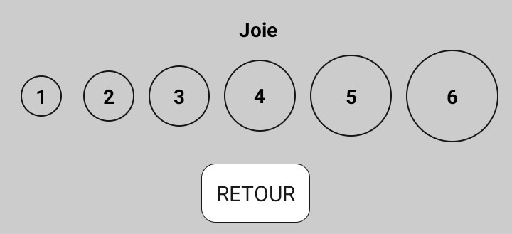
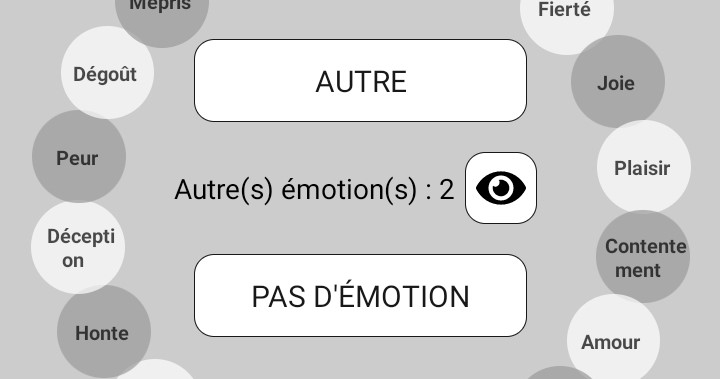
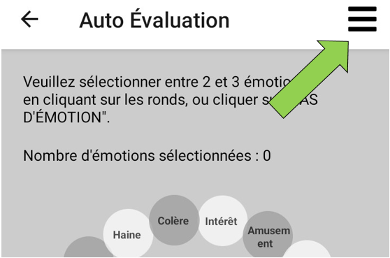
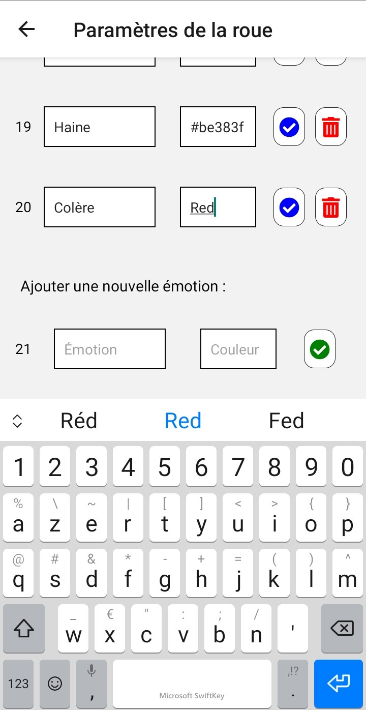

<!-- /*
 * Copyright 2021 Orange
 *
 * Licensed under the Creative Common by-nc-sa License, Version 4.0 (the "License");
 * you may not use this file except in compliance with the License.
 *    You may obtain a copy of the License at
 *
 * https://creativecommons.org/licenses/by-nc-sa/4.0/
 * https://creativecommons.org/licenses/by-nc-sa/4.0/legalcode.fr
 *
 *    Unless required by applicable law or agreed to in writing, software
 * distributed under the License is distributed on an "AS IS" BASIS,
 *    WITHOUT WARRANTIES OR CONDITIONS OF ANY KIND, either express or implied.
 *    See the License for the specific language governing permissions and
 * limitations under the License.
 */
-->

# Geneva Emotion Wheel - Publications initiales
SACHARIN, V., SCHLEGEL, K. & SCHERER, K. R. (2012). Geneva emotion wheel rating study
SIEGERT, I., BÖCK, R., VLASENKO, B., PHILIPPOU-HÜBNER, D. & WENDEMUTH, A. (2011).Appropriate emotional labelling of non-acted speech using basic emotions, geneva emotion wheel and self assessment manikins. 2011 IEEE International Conference on Multimedia and Expo, 1-6

# Emotion_Wheel: Utilisation de l'application

Quand vous lancez l'application, vous voyez une première page avec une courte description des principes de son utilisation, et deux boutons pour accéder à l'*AUTO ÉVALUATION* et aux *PARAMÈTRES*. En-dessous, les sources scientifiques qui ont permis d'élaborer ce travail sont citées.

## Auto évaluation
### Mode individuel
La page *AUTO ÉVALUATION* vous permet de sélectionner des émotions sur la roue.


Quand vous cliquez sur une émotion, vous êtes redirigé(e) vers une nouvelle page où vous pouvez sélectionner l'intensité correspondante.\
\
Vous pouvez alors sélectionner une intensité ou retourner (bouton *RETOUR*) à la roue des émotions (ceci va annuler l'ajout de la dernière émotion saisie).\
Si vous souhaitez supprimer une émotion que vous avez sélectionnée, il suffit de cliquer à nouveau sur cette émotion.\
Si vous souhaitez modifier l'intensité d'une émotion que vous avez sélectionnée, vous devez d'abord la supprimer (en cliquant dessus), puis l'ajouter à nouveau en cliquant encore dessus.

Si vous ne trouvez pas sur la roue l'émotion que vous (ou le sujet de votre expérience) avez ressentie, vous pouvez ajouter une émotion *AUTRE* en cliquant sur le bouton correspondant au centre de la roue. Il vous sera demandé de saisir le nom de cette nouvelle émotion, puis de sélectionner l'intensité. Ensuite, vous verrez apparaître en-dessous du bouton *AUTRE* au centre de la roue, le nombre d'émotions *autres* que vous avez saisies. Vous pourrez cliquer sur l'oeil pour voir les détails de ces autres émotions et les modifier ou supprimer. Vous pouvez ajouter seulement jusqu'à 2 émotions *autres*.\


Si vous (ou votre sujet) n'avez ressenti aucune émotion, vous pouvez cliquer sur le bouton *PAS D'ÉMOTION*. Si vous aviez sélectionné des émotions sur la roue ou ajouté des émotions *autres* au préalable, cette action va tout supprimer.

Une fois que vous êtes sûr(e) d'avoir entré toutes vos émotions (ou celles de votre sujet), vous pouvez cliquer sur *VALIDER LA SÉLECTION*. Pour pouvoir sauvegarder l'auto-évaluation, vous devrez avoir sélectionné *PAS D'ÉMOTION* ou entre le minimum et le maximum d'émotions sélectionnables (ces chiffres peuvent être changés dans la page *PARAMÈTRES*).\
La première fois, vous devrez donner à l'application l'autorisation d'écrire de nouveaux fichiers sur votre appareil.\
Le fichier avec la liste des émotions que vous avez saisies sera disponible dans le dossier *Téléchargements* de votre appareil.\
Le format de ce fichier est décrit dans la section *Format des fichiers de sauvegarde locaux*  ci-dessous.

### Spécificités du mode expérimentation
Dans le mode expérimentation, quand vous arrivez sur la page *AUTO ÉVALUATION*, vous pouvez voir un message indiquant que vous devez démarrer une nouvelle expérience avant de pouvoir faire une auto-évaluation.

Vous pouvez accéder aux *Paramètres d'expérience* en cliquant sur les trois traits en haut à droite de l'écran. Ils ne sont visibles qu'en mode Expérimentation.\


Dans cette page, vous pouvez démarrer une nouvelle expérience en lui donnant un nom et en cliquant sur le bouton *DÉMARRER*. Vous pouvez *TERMINER* l'expérience sur la même page. Quand vous démarrez une nouvelle expérience, toutes les auto-évaluations qui suivent sont sauvegardées dans le même fichier sur votre téléphone (même après avoir quitté et relancé l'application). Si vous démarrez une nouvelle expérience qui porte le même nom, elles seront également sauvegardées dans le même fichier. Si vous voulez sauvegarder les auto-évaluations dans un nouveau fichier, cliquez sur *TERMINER* l'expérience et choisissez un nom différent.

En-dessous, si vous sélectionnez le mode auto-incrément pour les identifiants des sujets, vous verrez l'identifiant du prochain sujet qui va être évalué (0, puis 1, puis 2, etc.). Ce nombre sera incrémenté à chaque fois que vous sauvegardez une auto-évaluation.\
Si vous avez choisi le mode manuel pour les identifiants des sujets, vous devrez entrer un identifiant et cliquer sur *NOUVEAU SUJET*. Si vous ne le faites pas, vous ne verrez pas la roue des émotions sur l'écran d'*AUTO ÉVALUATION*, mais un message pour expliquer que vous devez saisir un identifiant de sujet.\
En mode manuel, tant que vous ne modifiez pas l'identifiant du sujet, chaque nouvelle ligne dans le fichier des auto-évaluations sera sauvegardée avec le même identifiant de sujet. Vous devez penser à changer l'identifiant pour chaque nouveau sujet.

Vous pouvez ajouter un commentaire (facultatif) à la dernière auto-évaluation enregistrée. Vous devez écrire le commentaire sans virgules ni retours à la ligne (ils seront supprimés lors de la sauvegarde du commentaire). Après avoir rédigé le commentaire, cliquez sur le bouton *ENREGISTRER LE COMMENTAIRE*. Le commentaire sera ajouté à la fin de la dernière ligne d'auto-évaluation ajoutée au fichier CSV, ou au dernier enregistrement JSON si vous êtes en mode d'enregistrement des données en ligne sur une API. Dans ce dernier cas, si vous faites plusieurs commentaires pour une seule auto-évaluation, SEUL LE DERNIER COMENTAIRE SERA CONSERVÉ.

Une fois que vous avez réglé les paramètres de l'expérience, vous pouvez cliquer soit sur le bouton *VALIDER*, soit sur la flèche de retour en haut de votre écran. Les paramètres seront sauvegardés dans tous les cas.

Ensuite la roue des émotions apparaît, et elle fonctionne de la même manière qu'en mode individuel (voir la section *Mode individuel* ci-dessus).

## Paramètres
La page *PARAMÈTRES* vous permet de modifier certains réglages dans l'application.

* Vous pouvez sélectionner le mode d'auto-évaluation : en mode INDIVIDUEL, chaque auto-évaluation sera sauvegardée dans un nouveau fichier sur votre appareil ; en mode EXPÉRIMENTATION, vous devrez donner un nom à votre expérience, et chaque auto-évaluation sera sauvegardée comme une nouvelle ligne dans le même fichier.
* Si le mode EXPÉRIMENTATION est activé, vous verrez un paramètre supplémentaire : vous pourrez choisir d'entrer l'identifiant de chaque sujet vous-même au cours de l'expérience (auquel cas vous pourrez avoir plusieurs auto-évaluations pour le même sujet), ou bien de laisser l'application incrémenter l'identifiant du sujet automatiquement à chaque nouvelle auto-évaluation.
* Vous pouvez choisir d'enregistrer les données des auto-évaluations en local, auquel cas vous les retrouverez dans un fichier CSV dans le dossier Téléchargements ou Download de votre appareil (voir *Format des fichiers de sauvegarde locaux* pour plus de détails), ou bien en ligne, auquel cas elles seront sauvegardées au format JSON dans votre API (voir *Enregistrement sur une API* pour plus de détails).
* Si vous choisissez d'enregistrer les données des auto-évaluations en ligne, vous verrez apparaître deux champs à remplir pour indiquer le lien de votre API et le token d'autorisation si besoin.
* Vous pouvez modifier le nombre minimum et maximum d'émotions sélectionnables sur la roue (le minimum devra être inférieur ou égal au maximum).
* Vous pouvez changer les couleurs sur la roue : elle peut être affichée en niveaux de gris ou en couleurs.
* Vous pouvez mettre l'application en anglais ou en français. Cette action va changer la langue dans toute l'application et sur la roue, mais pas dans les fichiers sauvegardés (leur format est standard quelle que soit la langue, il est décrit dans la section *Format des fichiers de sauvegarde locaux* ci-dessous).

Vous pouvez accéder à la page *PARAMÈTRES DE LA ROUE* (voir le paragraphe ci-dessous).

Ensuite vous pouvez cliquer sur le bouton *RETOUR* ou sur la flèche retour en haut de votre écran : les deux vont conserver vos modifications. Ces dernières seront sauvegardées pour que vos préférences soient conservées lorsque vous ouvrirez l'application de nouveau.

## Paramètres de la roue
La page *PARAMÈTRES DE LA ROUE* est accessible depuis le bouton à la fin de la page *PARAMÈTRES*.

Elle vous permet de personnaliser la roue des émotions. Vous pouvez modifier le nom et la couleur (mais pas la couleur en niveaux de gris) d'une émotion. Vous pouvez également supprimer une émotion ou ajouter une nouvelle émotion à la roue (en bas de la page).\


Si vous choisissez de modifier une émotion (label et/ou couleur), vous devez ensuite cliquer sur le bouton bleu "valider" à droite de l'émotion pour valider vos modifications. Si vous modifiez plusieurs émotions, vous devez faire cela pour chacune d'entre elles.\
Quand vous avez terminé vos modifications, cliquez sur le bouton *VALIDER* en bas de la page si vous souhaitez qu'elles soient sauvegardées lorsque vous quittez l'application. Si vous ne le faites pas, vos modifications seront perdues lorsque vous quitterez l'application.

Si vous souhaitez revenir à la roue originale, cliquez sur le bouton *REVENIR À LA ROUE D'ORIGINE* puis quittez et relancez l'application.

## Sauvegarde des auto-évaluations

### Format des fichiers de sauvegarde locaux
Les fichiers sont enregistrés dans le dossier Téléchargements (ou Download) de l'espace de stockage par défaut de votre appareil.\
En mode individuel, ils sont appelés "emotion_wheel_AAAA_MM_JJ_hh:mm:ss.txt", avec AAAA_MM_JJ_hh:mm:ss.txt la date et l'heure exactes d'enregistrement de l'auto-évaluation.\
En mode expérimentation, ils sont appelés "emotion_wheel_TitreDeVotreExperience.txt".

Les fichiers sont sauvegardés sous un format CSV standard.\
Les en-têtes sont :
* subject-id: seulement visible en mode expérimentation ; l'identifiant du sujet évalué
* timestamp : la date et heure auxquelles l'auto-évaluation a été validée
* em0: em0 : l'intensité pour la 1ère émotion, ou -1 si elle n'a pas été sélectionnée
* em1 : l'intensité pour la 2ème émotion, ou -1 si elle n'a pas été sélectionnée
* ...
* em19 : l'intensité pour la 19ème émotion, ou -1 si elle n'a pas été sélectionnée
* other1-label : le label de la 1ère émotion autre que vous avez saisie, ou rien si vous n'en avez entré aucune
* other1-intensity : l'intensité de la 1ère émotion autre que vous avez saisie, ou rien si vous n'en avez entré aucune
* other2-label : le label de la 2ème émotion autre que vous avez saisie, ou rien si vous n'en avez entré aucune
* other2-intensity : l'intensité de la 2ème émotion autre que vous avez saisie, ou rien si vous n'en avez entré aucune
* no-emotion : 1 si l'utilisateur a déclaré "Pas d'émotion", 0 sinon
* comment: le commentaire que vous avez fait sur l'auto-évaluation, s'il y en a un

Les émotions sont rangées dans l'ordre suivant (si vous ne les avez pas modifiées dans les paramètres de la roue) :

| Index de l'émotion | Label de l'émotion (EN) | Label de l'émotion (FR) |
|:------------------:|:-----------------------:|:-----------------------:|
|         em0        |         Interest        |         Intérêt         |
|         em1        |        Amusement        |        Amusement        |
|         em2        |          Pride          |         Fierté          |
|         em3        |           Joy           |          Joie           |
|         em4        |         Pleasure        |         Plaisir         |
|         em5        |       Contentment       |      Contentement       |
|         em6        |           Love          |          Amour          |
|         em7        |        Admiration       |       Admiration        |
|         em8        |          Relief         |       Soulagement       |
|         em9        |        Compassion       |       Compassion        |
|        em10        |         Sadness         |        Tristesse        |
|        em11        |          Guilt          |       Culpabilité       |
|        em12        |          Regret         |         Regret          |
|        em13        |          Shame          |          Honte          |
|        em14        |      Disappointment     |        Déception        |
|        em15        |           Fear          |          Peur           |
|        em16        |         Disgust         |         Dégoût          |
|        em17        |         Contempt        |         Mépris          |
|        em18        |           Hate          |          Haine          |
|        em19        |          Anger          |         Colère          |

En mode individuel, chaque auto-évaluation est sauvegardée dans un nouveau fichier.\
En mode expérimentation, tant que vous ne changez pas le titre de l'expérience, chaque auto-évaluation est sauvegardée comme une nouvelle ligne dans le même fichier.

### Enregistrement sur une API
Pour enregistrer les auto-évaluations sur une API en ligne plutôt que sur votre appareil, vous devez sélectionner le mode "API" dans les paramètres, et fournir l'URL de l'API, ainsi que le token d'autorisation s'il y en a un.

Les auto-évaluations sont alors enregistrées au format JSON sur l'API. Vous devrez avoir une connexion internet lors de la validation d'une auto-évaluation, sinon celle-ci échouera.

Le format d'enregistrement des auto-évaluations en JSON est le suivant :

[{
    "_key":"Test_9390_2021_7_26_15:39:38",
    "timestamp":"2021_7_26_15:39:38",
    "experiment-title":"Test",
    "em0":5,
    "em1":-1,
    ...
    "em19":-1,
    "subject-id":0,
    "no-emotion":0,
    "comment":"My comment"
}]

La clef ("_key") est un identifiant unique pour chaque auto-évaluation enregistrée sur l'API. Elle est composée du titre de l'expérience s'il y en a un, d'un identifiant unique généré lors de l'installation de l'application, et de la date et l'heure d'enregistrement de l'auto-évaluation.
Les autres champs correspondent à ceux du format CSV.


# Emotion_Wheel: Running the Project

- [Emotionbot App](#emotionbot-app)

## Requirements
* [Node](https://nodejs.org/en/) 8 or greater
* All dependencies required by React Native (see [here](https://facebook.github.io/react-native/docs/getting-started) for the detail)

## Usage

Plug your smartphone to the computer or launch your emulator, then :
```
npm install
react-native run-android
react-native start
r
```

**NB: To setup your physical phone for development, check out [these steps](https://facebook.github.io/react-native/docs/running-on-device)**.

## Generate an release apk 

You have to create a key to sign the apk, with the following line 

from the project folder

```
$     keytool -genkey -v -keystore your_key_name.keystore -alias your_key_alias -keyalg RSA -keysize 2048 -validity 10000

```

Secondly, generate the installable build:

```
 react-native bundle --platform android --dev false --entry-file index.js --bundle-output android/app/src/main/assets/index.android.bundle --assets-dest android/app/src/main/res/
```

Then, generate the build using gradle:

```
cd android && ./gradlew clean
cd android && ./gradlew assembleRelease -x bundleReleaseJsAndAssets

```

The APK will be generated at : android\app\build\outputs\apk\app-release-unsigned.apk

You can install the apk on your phone. The -r flag will replace the existing app

```
adb install -r ./app/build/outputs/apk/release/app-release.apk
```

source : (see [here] (https://facebook.github.io/react-native/docs/signed-apk-android.html#adding-signing-config-to-your-app-s-gradle-config))

# Emotion_Wheel: Editing the Project

## Architecture

The whole app is based on the [React Native Boilerplate](https://github.com/thecodingmachine/react-native-boilerplate) project. We made minor adjustments to it, mainly removing folders that were not relevant to our project.  
You can find further informations on their Github page.

### Components

Contains all the [presentational components](https://medium.com/@dan_abramov/smart-and-dumb-components-7ca2f9a7c7d0) used in the app.  
Those should only aim at displaying the information, but not interact with it in any other meaningful fashion.

### Config

Contains configuration files for the application. It contains both `index.dev.js` and `index.prods.js`. The first contains all values used in a **development environment** while the latter contains values used in a **production environment**.  
**NB : The app requires an `index.js` file to work. Therefore, you *need* to copy the content of one of the other two files in a new file named as such in order to avoid errors when starting React Native.** While sometimes bothering when you forget about it, this makes sure do not start the app with production configuration when you are actually in a development environment and vice-versa.  
Be careful, the `index.js` file is purposefully git-ignored, to reinforce the absence of issues considering config files.

### Containers

Contains all container components. Contrary to presentational components, those mostly care about how the information flows through the app and the way the user will interact with it


### Stores

Contains all [Redux stores](https://redux.js.org/).

#### Add a new store

* Create a new folder.
* Add, as needed, `Actions.js`, `InitialState.js` and/or `Reducers.js` and complete them (see the other stores and/or the [redux documentation](https://redux.js.org/introduction/getting-started) for examples on how to do this).
* If applicable (it should be most of the time), add your reducer to the `index.js` file.

